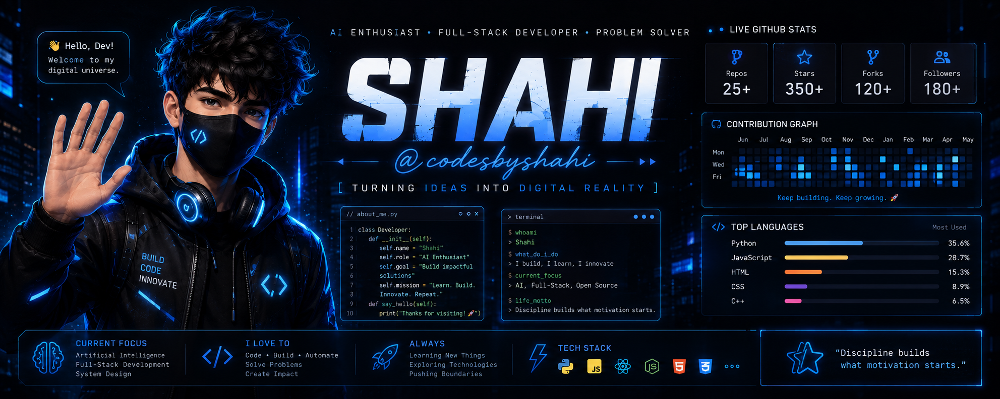

  

 

# SHAHI

### AI Enthusiast • Aspiring Full-Stack Developer • Building Intelligent Software

### ✨ "Turning Ideas Into Digital Reality."

 

---

# ⚡ Developer Philosophy

> I believe technology should solve real problems.
>
> Every project I build is another step toward becoming a world-class software engineer.
>
> I don't just write code.
>
> **I build experiences.**

---

# 🚀 About Me

I'm Shahi — a passionate learner exploring Software Development, Artificial Intelligence, and modern technologies.

Currently focused on building real-world applications that combine clean design, practical functionality, and continuous learning.

### Current Focus

- 💻 Full Stack Development
- 🤖 Artificial Intelligence
- ⚙️ Automation
- 🌐 Modern Web Applications
- 📈 Open Source

---

# 🧠 Tech Arsenal

### Frontend

### Learning

### Tools

---

# 🚀 Featured Project

## 📦 Inventory Management System

A modern inventory platform designed for businesses.

### Features

- Inventory Management
- Product Tracking
- Customer Management
- Sales
- Reports
- Analytics
- Responsive Dashboard

Status

🚧 Under Active Development

---

# 📊 GitHub Analytics

---

# 🏆 Achievements

---

# 📈 Contribution Graph

---

# 🎯 2026 Mission

- ✅ Build 15+ Professional Projects
- 🚀 Master Full Stack Development
- 🤖 Learn Artificial Intelligence
- 🌍 Contribute to Open Source
- 💼 Work with International Clients

---

# 🌌 Quote

> **"Discipline builds what motivation starts."**

---

# 📫 Connect

📧 yourcodeswithshahi777@gmail.com

💻 https://github.com/codesbyshahi

---

### ⭐ Thanks for visiting my profile ⭐

**Keep Learning • Keep Building • Keep Growing**

